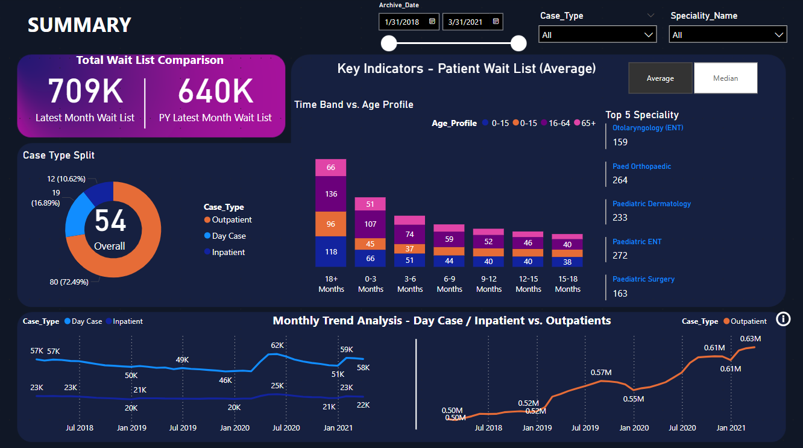
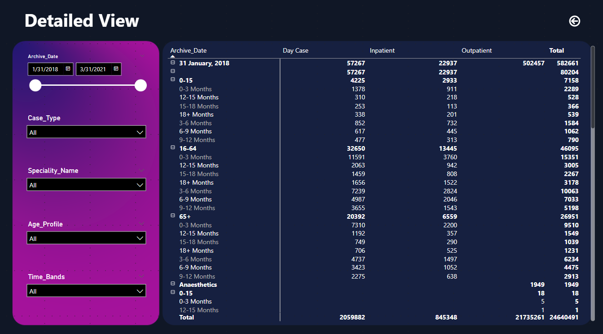

# 🏥 Patient-Waitlist-Analytics-Dashboard

📊 **An end-to-end Power BI dashboard to analyze patient waitlist trends by age group, case type, specialty, and time band over a 3-year period.**

  

---

## 🚀 Overview

This project presents an interactive Power BI dashboard designed to analyze and visualize healthcare patient waitlist data. Covering data from **January 2018 to March 2021**, it helps uncover trends, performance gaps, and demographic distribution across care types and specialties.

---

## 🧠 Key Features

- 🎯 **Dynamic KPIs** for total waitlist, previous year comparison, and average/median wait times  
- 🕒 **Time Series Trends** segmented by Day Case, Inpatient, and Outpatient  
- 🧓 **Age Profile Analysis** for 0–15, 16–64, and 65+ demographics  
- 🏥 **Top 5 Specialties** by waitlist volume  
- 🔍 **Detailed View Section** with slicers for date, age group, specialty, time band, and case type

---

## 🛠 Tech Stack

- **Power BI** – Dashboard development  
- **Power Query** – Data transformation and cleaning  
- **DAX** – Calculated measures and KPIs  
- **Excel/CSV** – Source data  
- **Interactive Filters & Slicers** – For user-driven exploration

---

## 📁 Dataset

- Found in the `Data` folder (zipped)
- Includes fields like: `Archive_Date`, `Case_Type`, `Speciality_Name`, `Age_Profile`, `Time_Bands`, `Patient_Counts`
- Cleaned and structured for seamless Power BI integration

---

## 📌 Use Cases

- Monitor and compare patient waitlist sizes over time  
- Identify delays in treatment by specialty or case type  
- Track age-based demand patterns and planning bottlenecks  
- Support evidence-based decision-making in healthcare operations

---

## ✅ Outcome

Built a high-impact, interactive dashboard enabling healthcare analysts and stakeholders to explore patient waitlist data, monitor trends, and improve planning and service delivery.

---

## 📎 Repository Description

> End-to-end Power BI dashboard analyzing healthcare patient waitlists across specialties, age groups, and case types using interactive filters and DAX-powered KPIs.